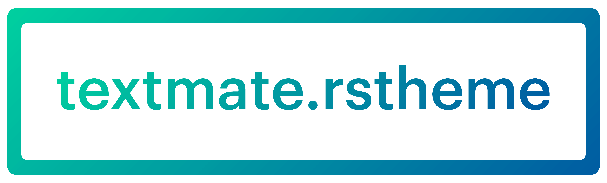
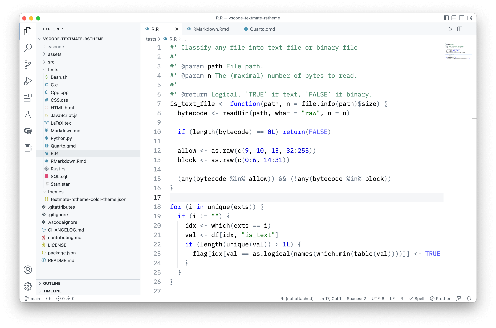
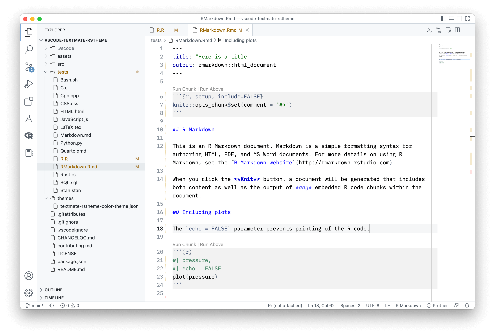

# textmate.rstheme

A light theme for Visual Studio Code inspired by the TextMate (default) theme in RStudio IDE.

## Screenshots

### R

### R Markdown/Quarto

All screenshots are captured using IBM Plex Mono at 18px.

## Installation

Search extensions for `textmate.rstheme` within VS Code to install this theme.

You can also install it from the [Visual Studio Marketplace](https://marketplace.visualstudio.com/items?itemName=nanxstats.textmate-rstheme) page.

## Programming languages and file formats tested

- Bash
- C/C++
- CSS
- Debian Control File
- Dockerfile
- Go
- Haskell
- HTML
- JavaScript
- JSON
- Julia
- Jupyter Notebook
- LaTeX
- Lua
- Makefile
- Markdown
- OCaml
- Perl
- Python
- Quarto
- R
- R Markdown
- Rust
- SAS
- Sass/SCSS
- Scala
- SQL
- Stan
- Stata
- Sweave
- Swift
- TypeScript
- YAML

## Contributing

- Feel free to [report an issue](https://github.com/nanxstats/vscode-textmate-rstheme/issues)
or [start a discussion](https://github.com/nanxstats/vscode-textmate-rstheme/discussions).
A minimal reproducible example would be helpful.
- Pull requests welcomed 👉 [contributing guide](https://github.com/nanxstats/vscode-textmate-rstheme/blob/main/contributing.md)

## Credits

- Code highlighting colors from [RStudio IDE](https://github.com/rstudio/rstudio/blob/785be459684006f95e947fe4e6f13f6a91db6762/src/cpp/session/resources/themes/textmate.rstheme), originally from the [textmate theme in Ace](https://github.com/ajaxorg/ace/blob/f1f6517a30d6819d1c8ca045744cdeb2925ccf0a/src/theme/textmate.css.js).
- Outer UI colors are derived from the 'GitHub Light Default' theme in [github-vscode-theme](https://github.com/primer/github-vscode-theme) and [shinyapps.io](https://www.shinyapps.io/).

## License

This theme is released under the [MIT License](LICENSE).

✨ Made by [Nan Xiao](https://nanx.me/). Find me on [LinkedIn](https://www.linkedin.com/in/nanxstats) or [Twitter](https://twitter.com/nanxstats) ✨
